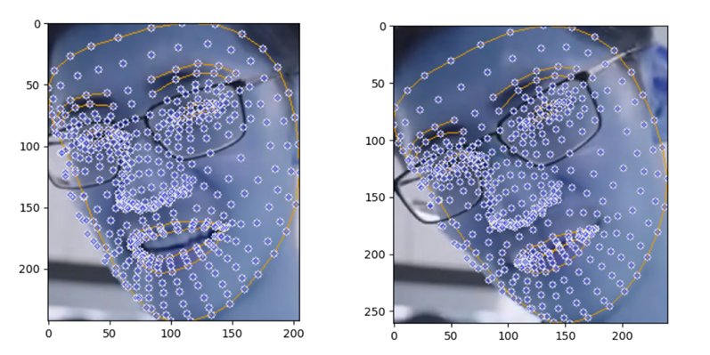
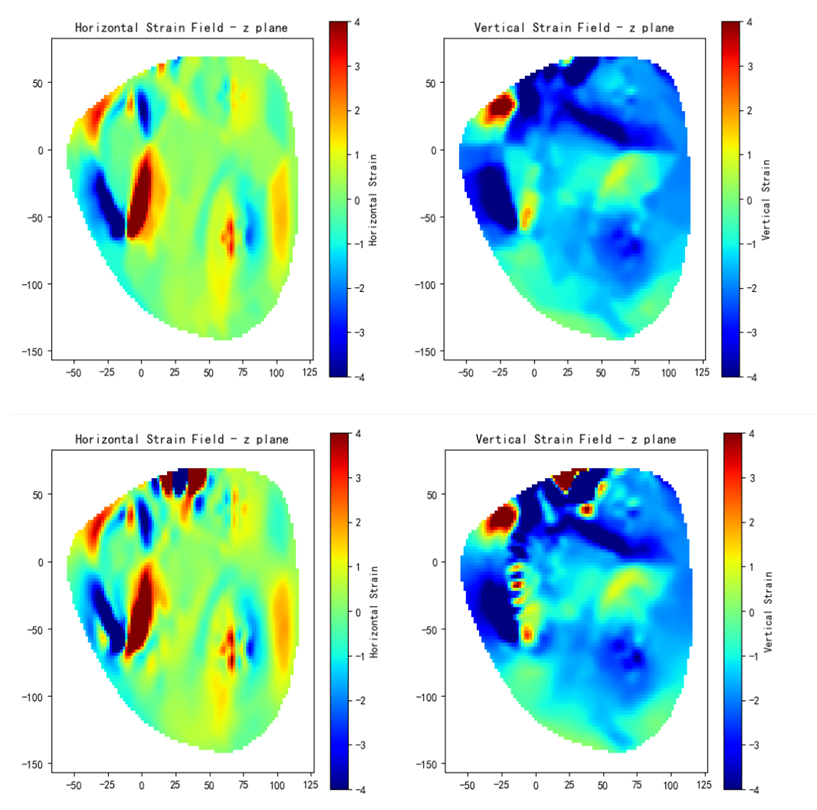
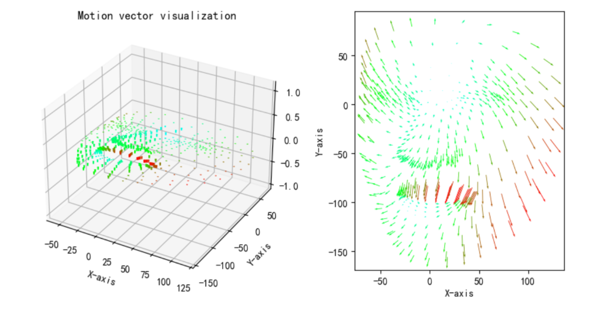
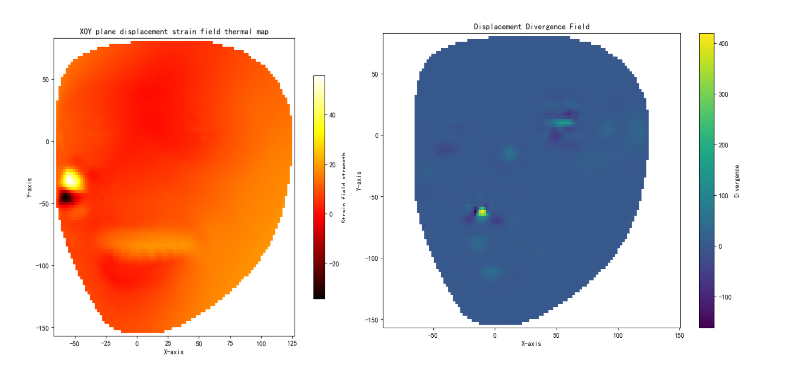
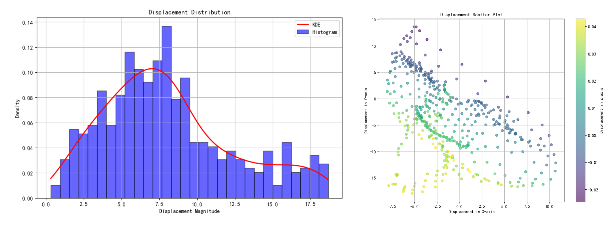

#  E-Care: Emotional health monitoring system based on 3D facial analysis and microexpression recognition
## Introduction
The Emotion and Cognitive Automated Recognition Engine (E-Care) is an innovative mental health monitoring system that uses 3D facial analysis and micro-expression recognition technology,To provide scientific insight into emotional states for emotionally vulnerable groups.The system aims to pay attention to special groups, especially left-behind children and elderly people living alone, by monitoring their mood changes in real time and providing a timely assessment of emotional health.The E-Care system is not only suitable for home and individual users, but also for clinical, educational and workplace Settings to monitor and improve emotional health. At present, the system is still being improved.
## Presentation
### Face key point detection

### Facial displacement strain field

### Facial key point space displacement field

### Facial displacement gradient field

### Statistical analysis

## Core design and methodology
The E-Care system uses a hybrid approach of visual schemes, combined with deep learning and rule-based systems, to effectively process and infer the emotional states of facial microexpressions.Compared with facial information acquisition schemes such as high-speed cameras and spectral analysis under laboratory conditions, the computer vision scheme of E-Care system has the advantages of faster speed and higher information acquisition accuracy in the test, and has better deployment capability in non-laboratory hardware environments with lower performance.The core components of the system are as follows:
### 3D facial key point detection and muscle movement analysis:
With the Mediapipe Face Landmark Detection Library, our system captures more than 400 face key points in real time and is able to model faces in real-time 3D.Analysis of key points in the face allows us to simulate the subtle muscle movements behind microexpressions, providing insight into the user's subconscious emotional state.

Facial key point analysis goes beyond traditional two-dimensional tracking by analyzing depth information.This enhances the precision of identifying tiny muscle contractions that contribute to transient emotional expression.The E-Care system can capture the tiny displacement of the face within about 1/70 second, draw the displacement vector field of the facial muscle over a continuous period of time, and accurately analyze the tiny changes of the facial muscle that cannot be captured by the human eye.We propose a new algorithm to analyze the displacement vector field of facial muscle. By solving the linear function of least square method, we can analyze the force point and direction of the force of facial muscle, which can further simplify the complicated displacement vector field of facial muscle.
### Microexpression recognition:
Unlike common macroscopic expressions, microexpressions are transient and often involuntary.By analyzing optical flow and geometric differentiation techniques, we can calculate the direction and intensity vector of each identified microexpression.

Based on our psychological research, specific microexpressions correspond to underlying emotional states.For example, an involuntary raising of the inner eyebrow, while subtle, may indicate sadness or worry.Our system has a database that links these movements to eight major emotions: anger, contempt, disgust, fear, happiness, neutrality, sadness, and surprise.The database is our self-established Human Emotion Classification dataset (E-CareDB), which covers 54,567 Asian faces and 73,045 European and American faces. The data of the dataset are selected from AffectNet, MMAFEDB and Asian facial expression dataset independently collected and built by us.A broad and culturally relevant classification model is ensured.
### Training and Deep learning emotion classifiers:
In parallel with microexpression analysis, our deep learning component is trained on a dataset covering eight emotional states using a YOLOv8n architecture.The data came from AffectNet, MMAFEDB, and custom Asian facial expression datasets, ensuring a broad and culturally relevant classification model.

Data enhancement techniques, such as horizontal flipping, allow us to balance the distribution of emotional categories in the data set.We pre-trained on AffectNet's smaller dataset (25,262 images), generated the pre-trained model and used the Adam optimizer to optimize on E-CareDB's larger dataset (127,612 images), with an optimization accuracy of more than 15%.
### Emotional inference of psychological information algorithm:
Rather than just relying on the usual black box output of deep learning, we've enhanced the system to incorporate a set of mental rules based on theories established in the study of emotions and microexpressions.These rules help interpret raw data and provide a contextual explanation of how certain microexpressions may lead to emotional outcomes.

### How to Use?
To use the E-Care system, follow these steps:
1. Install the required dependencies:

```python
pip install -r requirements.txt
```

2. In the Python environment, developers need to ensure that ecare modules are introduced:

```python
from ecare import *
```

3. After the above environment configuration operations are completed, the ECare class can be instantiated and the corresponding configuration class data passed in.The basic syntax for instantiation is as follows:
```python
ECare = ECare(
   	vid_model = model_video(
        faces_num=5,
        detail=True,
        detection_value=0.5,
        tracking_value=0.5
    ) ,
    img_model = ImgModel(
        faces_num = 5,
        detail = True,
        detection_value = 0.5,
        tracking_value = 0.5
    ),
    figure_config=FigureConfig(
        scale_factor=  1.0,
        colormap = 'hot',
        interpolation_method = 'cubic',
        set_figure_size = (10, 8),
        fixed_min = None,
        fixed_max = None,
        x_lim = (0, 0),
        y_lim = (0, 0),
        show_axes = True,
        show_colorbar = True,
        show_title = True
    ),
    video_config=VideoConfig(
        categories = None,
        fps = 24,
        filename = "out-video",
        video_format = 'mp4'
    ),
    img_data= ImgData(
        img_path = "./asserts/time1.jpg",
        img1_path = "./asserts/time1.jpg",
        img2_path = "./asserts/time2.jpg",
        output_path = "./asserts",
        img_array = None,
        img1_array = None,
        img2_array = None,
        fig_points = None,
        fig_strain_field_horizontal = None,
        fig_strain_field_vertical = None,
        fig_gradient = None,
        fig_divergence = None
    )
)
```

4. Then we can call the corresponding encapsulation method to process the picture and video respectively, let's take the processing of strain field as an example (other processing modes only need to modify the "style" parameter) :
```python
ECare.process_image(style="strain")
ECare.process_video(style="strain")
```

5. Of course, you can also use the visual E-Care interface. First, run the project in the file terminal where the project is located:
```python
(base) PS C:\YourProgramFile\e-care> python ecare.py
```
If the output:
```html
INFO: Created TensorFlow Lite XNNPACK delegate for CPU.
```
Congratulations! The project has started successfully.