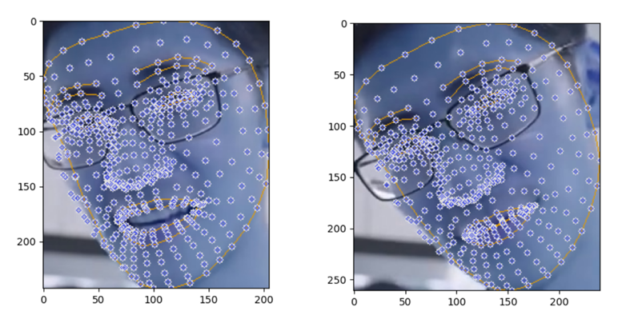

# E-Care：基于3D面部分析和微表情识别的情感健康监测系统

## 简介

情感与认知自动识别引擎（E-Care）是一种创新的心理健康监测系统，它利用3D面部分析和微表情识别技术，为情感脆弱群体提供科学的情感状态洞察。该系统旨在关注特殊群体，特别是留守儿童和独居老人，通过实时监控他们的情绪变化并及时评估情感健康状况来提供帮助。E-Care系统不仅适用于家庭和个人用户，也适用于临床、教育和工作场所环境，以监控和改善情绪健康。目前该系统仍在不断完善中。

## 展示效果

### 面部关键点检测


### 面部位移应变场


### 面部关键点空间位移场


### 面部位移梯度场


### 统计分析


## 核心设计与方法论

E-Care系统采用了视觉方案的混合方法，结合深度学习和基于规则的系统，有效处理和推断面部微表情带来的情感状态。相比实验室条件下高速摄像机和光谱分析等面部信息获取方案，在测试中计算机视觉方案具有速度更快、信息获取精度更高的优势，并且在性能较低的非实验室硬件环境中具有更好的部署能力。系统的核心组件如下：

### 3D面部关键点检测和肌肉运动分析：
通过Mediapipe面部标志点检测库，我们的系统能够实时捕获超过400个面部关键点，并能够实时构建3D面部模型。对面部关键点的分析使我们能够模拟微表情背后的细微肌肉运动，从而深入了解用户的潜意识情感状态。

面部关键点分析超越了传统的二维追踪，通过分析深度信息增强了识别导致短暂情感表达的微小肌肉收缩的精度。E-Care系统能够在约1/70秒内捕捉面部的微小位移，绘制连续时间段内的面部肌肉位移矢量场，并准确分析人眼无法捕捉的面部肌肉微小变化。我们提出了一种新的算法来分析面部肌肉的位移矢量场，通过求解最小二乘法的线性函数，可以分析面部肌肉的受力点和受力方向，进一步简化复杂的面部肌肉位移矢量场。

### 微表情识别：
不同于常见的宏观表情，微表情是短暂且通常是无意识的。通过分析光流和几何微分技术，我们可以计算出每个已识别微表情的方向和强度向量。

基于我们的心理学研究，特定的微表情对应潜在的情感状态。例如，不易察觉的眉毛内侧上扬可能表示悲伤或担忧。我们的系统拥有一个数据库，将这些动作与八种主要情绪联系起来：愤怒、轻蔑、厌恶、恐惧、快乐、中性、悲伤和惊讶。该数据库是我们自建的人类情感分类数据集（E-CareDB），涵盖了54,567张亚洲面孔和73,045张欧美面孔。数据集中的数据来自AffectNet、MMAFEDB以及我们独立收集和构建的亚洲面部表情数据集，确保了广泛且具有文化相关性的分类模型。

### 训练和深度学习情感分类器：
除了微表情分析之外，我们的深度学习组件使用YOLOv8n架构在涵盖八种情感状态的数据集上进行了训练。数据来源于AffectNet、MMAFEDB和定制的亚洲面部表情数据集，确保了一个广泛且具有文化相关性的分类模型。

数据增强技术，如水平翻转，使我们能够平衡数据集中情感类别的分布。我们在AffectNet较小的数据集（25,262张图像）上进行了预训练，生成了预训练模型，并使用Adam优化器在E-CareDB较大的数据集（127,612张图像）上进行优化，优化精度超过15%。

### 心理信息情感推理算法：
不同于仅仅依赖深度学习常用的黑盒输出，我们增强了系统以整合一套基于情感和微表情研究中建立的理论的心理规则。这些规则有助于解释原始数据，并提供上下文解释，说明某些微表情可能导致怎样的情感结果。

## 如何使用？

要使用E-Care系统，请按照以下步骤操作：

1. 安装所需依赖项：

```python
pip install -r requirements.txt
```

2. 在Python环境中，开发者需要确保引入ecare模块：

```python
from ecare import *
```

3. 完成上述环境配置操作后，可以实例化ECare类并传入相应的配置类数据。实例化的基本语法如下：
```python
ECare = ECare(
    vid_model = model_video(
        faces_num=5,
        detail=True,
        detection_value=0.5,
        tracking_value=0.5
    ) ,
    img_model = ImgModel(
        faces_num = 5,
        detail = True,
        detection_value = 0.5,
        tracking_value = 0.5
    ),
    figure_config=FigureConfig(
        scale_factor=  1.0,
        colormap = 'hot',
        interpolation_method = 'cubic',
        set_figure_size = (10, 8),
        fixed_min = None,
        fixed_max = None,
        x_lim = (0, 0),
        y_lim = (0, 0),
        show_axes = True,
        show_colorbar = True,
        show_title = True
    ),
    video_config=VideoConfig(
        categories = None,
        fps = 24,
        filename = "out-video",
        video_format = 'mp4'
    ),
    img_data= ImgData(
        img_path = "./asserts/time1.jpg",
        img1_path = "./asserts/time1.jpg",
        img2_path = "./asserts/time2.jpg",
        output_path = "./asserts",
        img_array = None,
        img1_array = None,
        img2_array = None,
        fig_points = None,
        fig_strain_field_horizontal = None,
        fig_strain_field_vertical = None,
        fig_gradient = None,
        fig_divergence = None
    )
)
```

4. 然后我们可以调用相应的封装方法分别处理图片和视频，以应变场处理为例（其他处理模式只需修改"style"参数）：
```python
ECare.process_image(style="strain")
ECare.process_video(style="strain")
```

5. 当然，您也可以使用可视化的E-Care界面。首先，在项目所在文件终端中运行项目：
```python
(base) PS C:\YourProgramFile\e-care> python ecare.py
```

如果输出：
```html
INFO: Created TensorFlow Lite XNNPACK delegate for CPU.
```
恭喜！项目已成功启动。